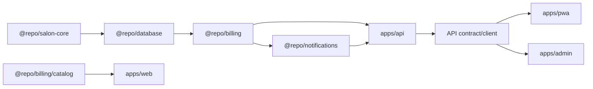

# Saluna monetization launch plan

**Date:** 2026-08-04  
**Status:** accepted; prices and quantities remain launch hypotheses  
**Related backlog:** `BL-0014 Payment plans and feature gates`

## Decision summary

Launch Saluna as salon-funded SaaS without a permanent free plan.

- Give each verified Salon Owner one 30-day full-product Trial, applied to the
  first Salon they activate.
- Transition every already-active Salon through one 30-day Trial when billing
  launches; this is the one-time exception to the per-owner Trial rule.
- Include up to 3 active Staff Profiles and 50 SMS credits in the Trial.
- Sell one Subscription per Salon, with four plans differentiated only by
  active Staff Profile limit and monthly SMS allowance.
- Make `15+` the final plan with no maximum Staff Profile limit; do not design
  another enterprise/custom tier.
- Keep all current core product features in every paid plan.
- Expire and refresh plan SMS Credits monthly, including on annual plans.
- Sell non-expiring prepaid SMS Credit Bundles separately; admin-granted credits
  join the same non-expiring balance.
- Keep authentication and security SMS outside the Salon's SMS balance.
- Let selected internal/test Salons use permanent Unlimited Access without
  payment, expiry, a recorded reason, or a Staff Profile limit; real SMS still
  consumes finite credits.
- Require explicit prepaid renewal and Verified Payment for customer paid
  access; platform staff cannot mark an unverified customer order paid.
- Use Zarinpal as the only launch Payment Provider while keeping purchase and
  payment records provider-neutral.
- Put catalog, subscription, entitlement, SMS Credit, and Zarinpal rules in one
  new `@repo/billing` package used by the API and messaging path.
- Give paid terms three days of Grace Period, then make the Salon read-only
  without changing its lifecycle status or automatically deleting its data.
- Keep the Salon as merchant and beneficiary for Client Payments; Saluna never
  receives, pools, or pays out money Clients owe a Salon.

This is the smallest complete model that can collect revenue, protect variable
SMS cost, and remain understandable to a salon manager.

## Goals

1. Convert a Salon from a Trial to a paid plan without staff intervention once
   self-service checkout ships.
2. Charge more as the Salon receives more value through more active Staff
   Profiles.
3. Prevent SMS usage from becoming an unbounded Saluna expense.
4. Preserve all Salon data when a Trial or subscription expires.
5. Let a two-person product team operate the first 20 paying Salons safely.
6. Learn whether the prices and limits convert before building advanced
   billing machinery.
7. Keep Salon Subscription payments separate from Client Payments collected by
   each Salon through its own merchant account.

## Non-goals for the first launch

- A permanent free plan.
- Per-feature paid tiers.
- Automatic card renewal.
- Proration, coupons, referral credit, or complex discounts.
- A plan-builder UI or database-configurable pricing catalog.
- Multi-location or consolidated organization billing.
- Shared subscriptions, Staff Profile limits, or SMS balances across Salons.
- A tier above `15+`, a custom quote flow, or an enterprise sales workflow.
- Bank-transfer activation or another payment rail beside Zarinpal.
- Manually marking customer orders paid.
- A multi-gateway router or generic payment-provider framework.
- A consumer marketplace, advertising/lead sales, transaction commissions, or
  custody of Client Payments.
- Customer SMS campaigns; the existing manager-triggered retention SMS is the
  first salon-funded SMS use case.
- Automated tax filing or accounting software integration.
- Deleting or hiding historical data when a plan changes.

## Commercial offer

All prices below are launch hypotheses, not permanent commitments. Confirm the
final amounts with 10 sales conversations and the contracted SMS unit cost
before publishing.

### Public plans

| Plan  | Active Staff Profiles | Included SMS/month |         Monthly |           Annual |
| ----- | --------------------: | -----------------: | --------------: | ---------------: |
| Solo  |                   1-2 |                150 |   490,000 toman |  4,900,000 toman |
| Salon |                   3-6 |                600 |   990,000 toman |  9,900,000 toman |
| Large |                  7-14 |              1,500 | 1,890,000 toman | 18,900,000 toman |
| 15+   |            15 or more |              3,000 | 2,990,000 toman | 29,900,000 toman |

Annual pricing is ten monthly payments paid upfront. Annual subscribers still
receive their included SMS monthly rather than receiving the whole year's
allowance at once.

Each plan covers exactly one Salon. A Subscription Purchase locks its price and
limits for that paid term; renewal uses the current published offer after
advance notice rather than preserving lifetime pricing.

The `15+` plan has no enforced upper limit. Its plan definition uses
`maxActiveStaff: null`; the entitlement check interprets `null` as unlimited.
Do not add custom pricing, quote requests, or another tier until real usage
shows that the `15+` offer is insufficient.

Every paid plan includes the current Saluna product: Appointments, Clients,
Staff Profiles and schedules, commissions and reports, Service Packages,
AppointmentRequests, the public Salon page, retention, messaging integrations,
and support. The plan table should not become a long feature comparison.

### SMS Credit Bundles

Use these only after confirming the provider's real landed cost per Persian SMS
segment, including taxes and government fees:

| Bundle        |    Launch price | Effective retail/credit |
| ------------- | --------------: | ----------------------: |
| 500 credits   |   169,000 toman |               338 toman |
| 2,000 credits |   649,000 toman |             324.5 toman |
| 5,000 credits | 1,590,000 toman |               318 toman |

The pricing rule is more important than these exact numbers:

```text
minimum bundle price = credits × worst contracted segment cost ÷ 0.70
```

Round upward to a simple retail price. This targets at least 30% gross margin
before support and payment-gateway fees. Reprice new purchases if the provider
cost changes; already purchased credits retain their face value.

## Product rules

### Trial eligibility

- One Trial per verified Salon Owner identity.
- Trial starts when a Salon first becomes active, including Salon Handoff.
- Trial duration is exactly 30 × 24 hours from `trialStartedAt`.
- Setup Salons do not consume Trial time.
- Trial includes the full current product, up to 3 active Staff Profiles, and
  one grant of 50 SMS credits.
- A platform owner may extend a Trial for a support case; the change must be
  audited.
- Creating or activating another Salon must not create another Trial for the
  same owner.
- At billing launch only, every already-active Salon receives one 30-day Trial,
  even when one Salon Owner operates more than one.

### Unlimited Access

- A platform owner may mark Saluna's own Salon or a test Salon with Unlimited
  Access.
- Unlimited Access requires no payment or Salon Subscription, has no expiry or
  recorded reason, and has no active Staff Profile limit.
- It is an explicit Salon entitlement, not a hard-coded Salon or user ID.
- Provider-billed SMS still consumes finite credits. A platform owner may add
  non-expiring credits to the Salon when needed.

### What counts as staff

The billing metric is the number of active salon-owned Staff Profiles.

- Login accounts and Staff Profile Access do not affect the count.
- A Staff Profile counts whether or not its invited identity has accepted
  access.
- A Salon Owner counts only if the owner also has an active Staff Profile used
  for appointments.
- Inactive Staff Profiles and their history do not count.
- Creating or reactivating a Staff Profile is blocked when it would exceed the
  plan limit.
- Existing Staff Profiles are never automatically deactivated.
- A downgrade cannot take effect while active Staff Profiles exceed the target
  limit. The manager must deactivate enough profiles first.

This preserves ADR-0006: the operational Staff Profile, not the login identity,
is the thing the Salon owns and receives scheduling value from.

### Included SMS

- One credit represents one billable SMS segment, not one send action.
- Show the estimated segment count before the manager confirms a send.
- Included credits reset at the start of each monthly allowance period and do
  not roll over.
- Annual plans also use monthly allowance periods.
- Consume included credits before purchased credits.
- Do not grant the next allowance until a paid subscription is active.
- Trial credits expire at the end of the Trial.

### Purchased SMS

- Purchased credits are available during Trial, active, and grace states.
- Purchased credits do not become available until payment is verified.
- Purchased credits use a balance separate from plan credits and never expire.
- Admin-granted credits join this non-expiring balance; ledger entries retain
  `admin_grant` as their source.
- Display plan and non-expiring balances separately before checkout and sending.
- Failed or skipped provider attempts do not consume credits.
- A provider-accepted message consumes credits even if a later handset-level
  delivery report says it was undeliverable, because the provider normally
  charges Saluna for that attempt.

Plan credits are always consumed before non-expiring credits.

### SMS provider billing profile

- One SMS Credit represents one provider-billable segment.
- The active provider owns a replaceable billing profile for encoding,
  single/multipart segment limits, and interpreting the provider's reported
  actual cost.
- The launch SMS.ir profile defaults to GSM-7 limits of 160/153 and Unicode
  limits of 70/67; profile configuration may replace these values when the
  provider or route differs.
- Show the provider-profile estimate before sending, then record and reconcile
  the actual provider cost after an accepted send.
- Changing SMS provider replaces its adapter and billing profile without
  changing plan definitions, balances, or the meaning of an SMS Credit.

### SMS that Saluna pays for

The following never use the Salon's balance:

- Login OTP.
- Signup OTP.
- Password-recovery OTP.
- Security and identity-verification messages.

Salon-funded SMS includes manager-triggered retention messages and future
appointment reminders, customer notifications, or campaigns. Each future SMS
entry point must explicitly declare whether it is platform-funded or
salon-funded; there must be no ambiguous default.

### Subscription access states

Do not overload `salon_profile.status`. An active Salon remains an active Salon
even when its commercial access becomes read-only.

| Access state | Reads   | Salon data writes  | Customer SMS                 | Billing/support |
| ------------ | ------- | ------------------ | ---------------------------- | --------------- |
| `trialing`   | Allowed | Allowed            | Allowed while credit remains | Allowed         |
| `active`     | Allowed | Allowed            | Allowed while credit remains | Allowed         |
| `grace`      | Allowed | Allowed for 3 days | Non-expiring balance only    | Allowed         |
| `read_only`  | Allowed | Blocked            | Blocked                      | Allowed         |

Rules:

- A Trial moves directly to `read_only` when it ends without payment.
- A paid term moves to `grace` for 3 days when it ends without renewal, then to
  `read_only`.
- Grace receives no new plan SMS allowance; existing non-expiring credits
  remain usable.
- Payment from `read_only` restores write access immediately after verification.
- The public Salon page may remain visible in `read_only`, but it must not accept
  a new AppointmentRequest. It explains that online requests are temporarily
  unavailable and keeps the Salon's public contact information visible.
- Existing Appointments, Clients, reports, and history remain readable.
- Nonpayment never starts a deletion timer. The Salon Owner may still export
  data or explicitly request account deletion.
- Billing checkout, payment callback, support conversations, account security,
  logout, data export/deletion, and a staff member leaving a Salon remain usable.
- Background jobs must not depend on a state-changing expiry cron for
  correctness; access is derived from timestamps at request time.

### Buying during a Trial

- Checkout rejects a plan whose Staff Profile limit is below the Salon's
  current active Staff Profile count. The manager must deactivate profiles or
  choose a larger plan first.
- `15+` always fits because it has no maximum; there is no “contact sales” path
  after it.
- The purchased plan and its Staff Profile limit become effective immediately.
- The paid term starts when the Trial would have ended, so early payment does
  not remove remaining Trial days.
- The first paid SMS allowance starts when the paid term starts; the Trial grant
  remains in use until then.

### Renewal, plan change, cancellation, and refunds

- There is no automatic charge in v1. A manager buys another monthly or annual
  term.
- Send in-app renewal reminders 7 days, 3 days, and 1 day before the paid term
  ends. Use SMS only with explicit product approval because it is a Saluna cost.
- Renewal purchased before expiry begins at the current term's end.
- A downgrade is scheduled for renewal and requires the Staff Profile count to
  fit before checkout.
- Handle mid-term upgrades through support during the first 20 paying Salons.
  Support sends a normal Zarinpal checkout for the target plan; after verified
  payment, a platform owner may preserve already-paid time by extending the new
  end date with an audited reason. Do not accept bank transfer or arbitrary
  admin-entered amounts. Add self-service proration only when this path becomes
  frequent.
- Cancellation means not renewing; Saluna stores no card and initiates no
  future charge.
- Refunds follow a published policy and are processed manually at the gateway.
  A platform owner then records the refund and reverses unused purchased SMS or
  the paid term as appropriate. Never delete the original payment record.

### Price changes

- Every order stores the plan/bundle SKU, price version, amount, interval, staff
  limit, and SMS grant as an immutable purchase snapshot.
- A code deployment may publish a new price version for future checkouts.
- Active terms keep their purchased limits and dates.
- Renewal uses the current published price, with at least 30 days' notice for
  annual customers when operationally possible.

### Client Payments

- Saluna charges Salons only for Subscription Purchases and SMS Credit Bundles.
- A future Client deposit or service payment uses a salon-owned payment account;
  the Salon remains the merchant and beneficiary.
- Saluna may facilitate checkout but never receives, pools, holds, or pays out
  Client funds.

## Technical design

### Domain language

Use the accepted definitions in `GLOSSARY.md` and ADR-0019 through ADR-0037.
Implementation must not introduce alternate meanings for Trial, Salon
Subscription, Unlimited Access, Staff Profile Limit, SMS Credit, SMS Allowance,
SMS Credit Bundle, SMS Credit Grant, Verified Payment, Grace Period, or
Read-Only Access.

### Plan catalog

Keep versioned plan and bundle definitions as typed constants in the new
`@repo/billing` package. Do not add a plans table or admin plan editor in v1.

Each plan definition needs:

- Stable SKU and public name.
- Price version.
- Billing interval.
- Amount in toman.
- Maximum active Staff Profiles, nullable only for the unlimited `15+` plan.
- Monthly SMS allowance.
- Whether the plan is publicly purchasable.

Money is stored in toman throughout Saluna. Zarinpal's current API accepts
`currency: "IRT"`, so send and verify the exact snapshotted toman amount without
converting it to rial. If a future gateway accepts rial only, its adapter owns
the conversion and its boundary test.

### Minimum database model

#### `salon_subscriptions`

One current commercial record per Salon:

- `salon_id` primary key.
- `unlimited_access` boolean, with no expiry or reason fields.
- `plan_sku` nullable during a Trial.
- `price_version` nullable during a Trial.
- `status`: `trialing | active | grace | read_only`.
- `trial_started_at`, `trial_ends_at`.
- `current_period_started_at`, `current_period_ends_at`.
- `grace_ends_at`.
- `max_active_staff` nullable purchase snapshot; `null` means unlimited.
- `monthly_sms_allowance` purchase snapshot.
- `created_at`, `updated_at`.

Do not store a redundant computed `daysRemaining`.

#### `billing_orders`

An immutable checkout/payment attempt:

- `id`, `salon_id`, and creating manager user ID.
- `kind`: `subscription | sms_bundle`.
- Payment Provider identifier and opaque provider references.
- SKU, price version, and a small immutable product snapshot.
- `amount_toman`; Zarinpal request/verification always use this value with
  currency `IRT`.
- `status`: `pending | paid | failed | expired | refunded`.
- Provider request/reference IDs and failure code.
- `idempotency_key` unique.
- `created_at`, `paid_at`, `refunded_at`.

Provider request and successful reference IDs must be unique per Payment
Provider where present.

#### `salon_sms_wallets`

One lockable row per Salon:

- `salon_id` primary key.
- `plan_balance`, `plan_expires_at`, and allowance period key.
- `non_expiring_balance`, containing purchased and admin-granted credits.
- `updated_at`.

#### `sms_credit_ledger`

An immutable audit record for every grant, debit, refund, expiry, and manual
adjustment:

- Salon ID, source type, signed credit delta, and which balance changed.
- Source distinguishes `plan_allowance`, `bundle_purchase`, and `admin_grant`;
  the latter two update the same non-expiring balance.
- Related billing order, delivery, or allowance-period key when applicable.
- Request/idempotency key unique.
- Actor user ID for manual adjustments.
- Created timestamp and small non-secret metadata.

The wallet is the current balance; the ledger explains how it got there. Every
balance change updates both in one database transaction.

### Trial creation

- Extend the existing Salon activation/Handoff transaction to create the Trial
  and wallet exactly once.
- Check Trial eligibility by verified owner identity before granting it.
- The activation must remain idempotent: a retried Handoff returns the existing
  Trial instead of adding 30 more days or another 50 credits.
- Setup data creation remains independent of billing.
- Add a one-time billing-launch migration that gives every already-active Salon
  a 30-day Trial, regardless of shared ownership; normal per-owner eligibility
  applies after that migration.

### Access enforcement

Create one server-side commercial-access resolver by Salon ID. UI locks are
explanations, never enforcement.

- Resolve access after tenant authentication.
- Let reads continue in every access state.
- Apply one shared write guard to tenant mutations.
- Explicitly allow billing, support, account-security, logout, and staff-leave
  operations plus owner-controlled export/deletion through the guard.
- Unlimited Access bypasses Trial/subscription expiry and Staff Profile limits,
  but never bypasses SMS Credit checks.
- Apply the same access check to public AppointmentRequest creation.
- Return one stable API code such as `subscription_read_only` with the renewal
  URL, not route-specific Persian strings.
- Cache only within a request initially; add cross-request caching only if
  measurement shows a problem.

Staff Profile limits require a second server-side check in the shared database
create/reactivate path. Lock the Salon's subscription row while checking and
creating/reactivating so concurrent requests cannot exceed the limit.

### SMS charging boundary

All salon-funded SMS must pass through one charged-send function in
`@repo/notifications`.

1. Normalize and validate the recipient and message.
2. Ask the configured SMS provider billing profile for the segment estimate.
3. Lock the wallet row.
4. Expire only stale monthly plan credits and write the expiry ledger entry;
   never expire the purchased/admin-granted balance.
5. Reject insufficient credit without calling the provider.
6. Debit plan balance first, then non-expiring balance, and write an
   idempotent ledger event.
7. Call the existing SMS provider.
8. If the provider returns `failed` or `skipped`, refund the same balances in a
   transaction and record the refund.
9. Persist the provider result, estimated segments, and reported actual cost;
   reconcile any mismatch without silently changing plan definitions.

Retries reuse the same stable request ID. A duplicated HTTP request must not
charge twice or send twice. OTP send functions bypass the charged-send function
and keep their existing throttling and security behavior.

### SMS allowance renewal

- A daily job expires the previous plan balance and grants the current monthly
  allowance using a unique
  `salon + allowance period` key.
- The billing summary and charged-send path also call an idempotent
  `ensureCurrentAllowance` function. A missed job therefore delays a reminder
  but cannot permanently withhold credits.
- Annual subscriptions compute each allowance period from the paid term start,
  not from the Persian calendar month.
- Grace and read-only states receive no new allowance.

### Payment gateway

Use Zarinpal through direct HTTPS calls; do not add a generic gateway interface
or SDK in v1. Its documented flow is sufficient: request a payment, redirect
using the returned authority, then verify the callback server-to-server.

Billing Orders remain provider-neutral: store `provider = zarinpal` and opaque
provider request/reference IDs rather than Zarinpal-named commercial columns.

Required behavior:

- Create the local pending order before requesting the gateway authority.
- Send `currency: "IRT"`, the local order ID, manager phone, callback URL, and
  the exact local order amount. Keep the merchant ID in server environment
  configuration.
- Never trust query-string callback status as proof of payment.
- Verify authority and exact amount with the gateway from the server.
- Apply a successful order and mark it paid in one idempotent database
  transaction.
- Repeated callbacks return the original success result.
- A callback with the wrong amount, Salon, SKU, or already-used authority does
  not grant access or credits.
- Log gateway codes without logging secrets or customer banking data.
- Gateway unavailability never revokes an already active term.
- Keep merchant ID and gateway URLs in environment configuration.
- Exercise the sandbox before production credentials are enabled.
- Treat Zarinpal codes `100` (verified now) and `101` (already verified) as
  distinct idempotency cases. A `101` response grants nothing unless the local
  authority/order can be reconciled to the original successful payment.
- Saluna absorbs the gateway fee in its published prices; do not surprise the
  manager with a fee at checkout.

## Implementation ownership by workspace

The apps must not each implement their own idea of a plan, Trial, expiry, SMS
balance, or successful payment. `@repo/billing` owns those rules. Database code
owns persistence, the API owns HTTP/authentication, and each frontend only
renders server answers and initiates allowed commands.



### New package: `packages/billing` (`@repo/billing`)

This is the only new package required. It is a Saluna domain package, not a
generic billing framework.

Suggested minimum layout:

```text
packages/billing/
├── package.json
├── tsconfig.json
└── src/
    ├── catalog.ts
    ├── access.ts
    ├── subscriptions.ts
    ├── sms-credits.ts
    ├── zarinpal.ts
    └── index.ts
```

Responsibilities:

- `catalog.ts`
  - Defines the four public plan SKUs and three SMS Bundle SKUs.
  - Holds versioned monthly/annual prices, SMS allowances, and Staff Profile
    limits.
  - Represents `15+` with `maxActiveStaff: null`.
  - Resolves only known, currently purchasable SKUs; browser-supplied amounts or
    limits are never accepted.
- `access.ts`
  - Derives `trialing | active | grace | read_only` from subscription timestamps.
  - Answers `canWrite`, `canSendSalonSms`, and whether a requested active Staff
    Profile count fits a plan.
  - Resolves Unlimited Access without an expiry or Staff Profile limit while
    still requiring SMS Credits.
  - Returns stable reason codes used by the API and frontends.
- `subscriptions.ts`
  - Starts an eligible Trial exactly once.
  - Produces the manager billing summary.
  - Creates a pending subscription order from a catalog SKU.
  - Applies a verified subscription order once.
  - Grants the correct current monthly SMS allowance.
  - Schedules renewal/downgrade according to the product rules.
- `sms-credits.ts`
  - Reserves credits from the provider billing profile's estimate.
  - Creates SMS Bundle orders.
  - Applies a verified Bundle order once.
  - Reserves plan then non-expiring credit transactionally and refunds a
    failed/skipped send.
  - Expires monthly plan credits but never expires purchased/admin-granted
    credits.
  - Keeps platform-funded OTP outside the Salon wallet.
- `zarinpal.ts`
  - Calls only Zarinpal request and verify endpoints.
  - Sends explicit `IRT`, snapshotted amount, local order ID, callback URL, and
    manager phone.
  - Parses Zarinpal responses into narrow Saluna results.
  - Knows codes `100` and `101`; it does not grant subscriptions or credits.

Dependencies:

- `@repo/database` for billing persistence functions.
- `@repo/salon-core` only for existing shared primitives such as validated
  identifiers/time helpers if actually needed.
- `zod` for gateway response/input validation.
- Native `fetch`; no Zarinpal SDK and no generic payment-provider interface.

`package.json` exports:

- `.` for shared types/results that are safe in either runtime.
- `./catalog` for static, client-safe plan and Bundle definitions.
- `./server` for database-backed subscription, SMS Credit, and Zarinpal
  operations.

Use the repository-standard lint, typecheck, and Vitest scripts plus
`@repo/typescript-config`; introduce no new test runner.

Exports should keep client-safe catalog/access types separate from server-only
services, for example `@repo/billing/catalog` and `@repo/billing/server`. The
public web may import the catalog; browser bundles must never import database or
merchant code.

Package checks:

- Catalog SKU snapshots and the unlimited `15+` rule.
- Trial/access boundary timestamps.
- Unlimited Access bypasses payment and Staff Profile limits but not SMS Credit.
- Staff limit decisions.
- SMS balance allocation and monthly plan-credit expiry.
- Zarinpal request/response parsing, `IRT`, and `100`/`101` behavior using a
  mocked `fetch`.
- Subscription/order application idempotency through database fakes or focused
  integration tests.

### Existing package: `packages/database` (`@repo/database`)

Database remains the only package that imports Drizzle and PostgreSQL.

Likely files: `packages/database/src/schema.ts`, new
`packages/database/src/billing.ts`, `packages/database/package.json`, and one
checked-in migration plus focused unit/integration tests.

Changes:

- Add the four billing tables and checked-in migration described above.
- Export a new `@repo/database/billing` module.
- Provide small persistence/transaction functions used by `@repo/billing`:
  - get/create/lock a Salon Subscription;
  - count active Staff Profiles while the subscription row is locked;
  - create and resolve Billing Orders by ID and provider-neutral request/reference
    ID;
  - atomically mark one order paid and apply its purchase snapshot;
  - lock/update the SMS wallet and append ledger rows;
  - list manager/admin payment history;
  - find allowance/renewal work by timestamp.
- Extend the existing Salon Handoff database function to accept a validated
  Trial snapshot produced by `@repo/billing` and create the subscription/wallet
  in the same transaction that activates the Salon. The database package must
  not import `@repo/billing` or contain plan catalog constants.
- Add the charged segment count and related SMS ledger/request identifier to the
  existing delivery record where needed for reconciliation.

Concurrency requirements:

- Lock the subscription row while checking and creating/reactivating a Staff
  Profile so two requests cannot cross a finite plan limit.
- Lock the wallet while reserving credits so concurrent sends cannot overdraw.
- Use unique provider/request reference, order idempotency, allowance-period,
  and SMS request keys.
- Apply order status and resulting subscription/credit changes in one database
  transaction.

Database checks:

- Migration/schema parity through the existing `pnpm db:check` path.
- Real PostgreSQL integration coverage for concurrent Staff Profile activation,
  concurrent SMS reservations, duplicate callback application, and Handoff
  retry.

### Existing package: `packages/notifications` (`@repo/notifications`)

The provider package continues to own SMS delivery and its SMS Billing Profile;
it does not own prices, balances, or plan policy.

Likely files: `packages/notifications/package.json`,
`packages/notifications/src/sms.ts`, `packages/notifications/src/index.ts`, and
the existing SMS tests.

Changes:

- Add `@repo/billing` to `packages/notifications/package.json` as a workspace
  dependency.
- Extend the existing `SmsProvider` with provider-specific segment estimation
  and reported-cost parsing. Keep GSM-7 160/153 and Unicode 70/67 as the SMS.ir
  profile defaults with provider configuration able to replace them.
- Add one salon-funded wrapper around the existing `sendSmsText` path:
  1. ask the configured provider profile for an estimate;
  2. ask `@repo/billing` to reserve those segment credits;
  3. call the existing SMS.ir provider;
  4. refund through `@repo/billing` on `failed` or `skipped`;
  5. persist the estimate, provider result, and reported actual cost for
     reconciliation.
- Route birthday retention SMS through the charged wrapper.
- Keep OTP helpers on the existing uncharged path.
- Require every future SMS caller to choose `platformFunded` or `salonFunded`
  explicitly in its API; do not infer this from arbitrary message purpose.

Checks:

- Insufficient credit never calls SMS.ir.
- Failure refunds once; retry does not double-send or double-charge.
- Provider-profile estimates cover Latin, Persian/Unicode, and concatenated
  boundaries, and the SMS.ir response retains its reported `Cost`.
- OTP sends without a wallet and never changes credit.

### Existing package: `packages/salon-core` (`@repo/salon-core`)

Keep general Salon domain primitives here, but do not put plans or Zarinpal in
this package.

Changes:

- Add the resolved subscription terms to `GLOSSARY.md`, not to unrelated
  appointment types.
- Reuse existing date, Persian-digit, money, and validation helpers where they
  already fit.
- Add no billing dependency; this keeps the dependency graph acyclic.

### Existing package: `packages/auth` (`@repo/auth`)

No plan catalog or payment code belongs here.

Changes:

- Keep identity and tenant authorization unchanged.
- If the API needs it, extend the request-scoped tenant type with a resolved
  commercial-access summary supplied after authentication.
- Do not turn a plan into a role or permission.

### App: `apps/api` (`@repo/api`)

The Hono API is the only network boundary for billing. Handlers validate and
delegate to `@repo/billing`; they do not calculate prices, balances, dates, or
Staff Profile limits.

Add `@repo/billing` to `apps/api/package.json`.

Likely files: `apps/api/src/app.ts`, `apps/api/src/env.ts`,
`apps/api/src/factory.ts`, `apps/api/src/middleware/auth.ts`, new
`apps/api/src/middleware/subscription.ts`, new `apps/api/src/routes/billing.ts`,
the Salon Handoff/staff/retention/public-request routes, and matching OpenAPI
and route tests.

New routes:

- `GET /api/v1/billing/summary`
- `GET /api/v1/billing/orders`
- `GET /api/v1/billing/orders/:orderId`
- `POST /api/v1/billing/checkout`
- `GET /api/v1/billing/callback/zarinpal`

Admin additions under the existing admin route:

- `GET /api/v1/admin/salons/:salonId/billing`
- `POST /api/v1/admin/salons/:salonId/billing/trial-extension`
- `POST /api/v1/admin/salons/:salonId/billing/unlimited-access`
- `POST /api/v1/admin/salons/:salonId/billing/sms-adjustment`
- `POST /api/v1/admin/salons/:salonId/billing/refund-record`

Manager route behavior:

- `summary` and `orders` require the authenticated manager's Salon.
- `checkout` accepts only a catalog SKU and idempotency key, creates the local
  pending order, requests a Zarinpal authority, and returns the redirect URL.
- Callback is public but rate-limited. It finds the local order by authority,
  verifies server-to-server, applies it once, then redirects to a PWA result URL
  carrying only the local order ID.
- The PWA retrieves final status from Saluna; it never trusts Zarinpal callback
  query parameters.

Middleware changes:

- Keep `requireTenant` responsible for identity, Salon, and role.
- Add a factory-created Hono middleware that asks `@repo/billing` for
  request-scoped commercial access and stores it with `c.set()`.
- Add `requireTenantWrite(permission?)`, composed from existing tenant auth and
  the commercial write guard. Replace `requireTenant` with it on every
  operational `POST`, `PUT`, `PATCH`, and `DELETE` route. Reads keep
  `requireTenant`; blocked writes return `subscription_read_only`.
- Billing, support messages, account security, logout, and a staff member
  leaving a Salon deliberately keep their existing auth path instead of using
  `requireTenantWrite`; avoid a fragile URL allowlist inside the guard.
- Apply the same `@repo/billing` access decision to public AppointmentRequest
  creation.
- Do not use UI state or route-specific hand-written checks as enforcement.

Existing route changes:

- Staff Profile create/reactivate delegates the finite/unlimited limit decision
  to `@repo/billing` and uses the database transaction described above.
- Retention SMS calls the new salon-funded notification wrapper.
- Salon Handoff starts the Trial exactly once after activation.
- Saluna currently has no Salon data-export or owner account-deletion route;
  add those owner-controlled account paths outside `@repo/billing` and keep them
  available during Read-Only Access.
- Any existing mutation route covered by the write guard gets a focused test
  proving that direct API calls cannot bypass read-only state.

Environment:

- `ZARINPAL_MERCHANT_ID`
- `ZARINPAL_API_BASE_URL`
- `ZARINPAL_START_PAY_BASE_URL`
- `ZARINPAL_CALLBACK_URL`
- Sandbox values outside production; no secrets returned by health/config APIs.

API checks use chained Hono routes and `app.request()`/the existing route-test
pattern. After implementation, run `npx hono request` against billing summary
and checkout with test-safe authentication setup; never put credentials on the
command line.

### Existing packages: `packages/api-contract` and `packages/api-client`

These remain generated boundaries, not homes for business logic.

Likely files: new `apps/api/src/openapi/schemas/billing.ts`, new
`apps/api/src/openapi/routes/billing.ts`, the OpenAPI contract registration,
and regenerated files under `packages/api-contract` and `packages/api-client`.

Changes:

- Add OpenAPI schemas for billing summary, plan/bundle SKU, order status,
  checkout request/response, and stable commercial error codes.
- Document callback behavior but do not expose merchant credentials or raw
  gateway responses.
- Regenerate `@repo/api-contract` and `@repo/api-client` after the Hono routes
  are complete.
- Add one generated-client wrapper/query-key layer per existing PWA/admin
  convention; do not hand-write a second fetch client.

### App: `apps/pwa` (`@repo/pwa`)

The PWA is the manager billing surface.

Likely files: `apps/pwa/src/routes/_authed/settings.tsx`, new
`apps/pwa/src/routes/_authed/billing.tsx`, new
`apps/pwa/src/routes/_authed/billing-result.$orderId.tsx`, new
`apps/pwa/src/lib/billing-queries.ts`, `apps/pwa/src/routes/__root.tsx` or the
authenticated shell for the read-only banner, the Staff/retention surfaces,
and focused interaction tests.

Changes:

- Add a manager-only “Plan and SMS” row to the existing Settings screen.
- Add a focused billing route using generated API-client calls and TanStack
  Query.
- Show Trial/subscription state, exact end date, current plan, active Staff
  Profiles used/allowed, the current plan SMS balance and monthly expiry, and
  the non-expiring purchased/admin-granted SMS balance.
- Render all four plans, including `15+` as “15 staff or more” with no maximum.
- Allow monthly/annual plan checkout and SMS Bundle checkout.
- Redirect the browser to the server-provided Zarinpal URL.
- Add a payment result route that queries the local Billing Order and renders
  pending/success/failure without trusting URL status.
- Add a non-dismissible read-only banner with a restore-access action.
- Add owner data-export and explicit account-deletion actions that remain
  reachable from read-only mode.
- Preserve drafted SMS text when sending fails for insufficient credit and link
  to Bundle checkout.
- Show estimated segments and resulting balance before salon-funded sends.
- On Staff Profile create/reactivate, show current finite limit or “unlimited”
  and explain a server rejection without duplicating enforcement.

Reuse existing Settings rows, cards, buttons, dialogs, loading/error states,
Persian digit formatting, and responsive patterns. Do not create a separate
billing design system.

PWA checks:

- Trial, active, grace, and read-only rendering.
- Finite plan versus unlimited `15+` display.
- Checkout redirect using only the returned URL.
- Pending/success/failure result refresh.
- Insufficient SMS credit preserves the draft.

### App: `apps/admin` (`@repo/admin`)

Admin gets operational visibility inside the existing Salon Workspace, not a
separate billing application and not an offline-sales flow.

Likely files: `apps/admin/src/routes/_admin/salons.$salonId.tsx`, new
`apps/admin/src/features/salons/salon-billing.tsx`, the Salon feature exports,
and existing Salon Workspace tests.

Changes:

- Show subscription state/dates, plan snapshot, active Staff Profile count,
  Unlimited Access, SMS balances, Billing Orders, provider request/reference
  IDs, and reconciliation
  warnings.
- Allow `manage_salons` to set Unlimited Access with no reason or expiry fields
  and to grant finite, non-expiring SMS Credits.
- Allow a platform admin with `manage_salons` to extend a Trial, correct a
  credit ledger through a reversing adjustment, or record a completed gateway
  refund. Corrections/refunds retain their existing audit requirements;
  Unlimited Access itself requires no recorded reason.
- Show related `admin_audit_events`.
- Do not allow an admin to invent a plan, type an arbitrary paid amount, mark an
  unverified order paid, or expose gateway secrets.

Admin checks:

- `view_salons` can read billing information.
- Only `manage_salons` can perform supported corrections.
- Every correction is audited with the real actor and leaves the original
  order/ledger history intact.

### App: `apps/web` (`@repo/web`)

The public website explains the offer and begins signup; it does not call
Zarinpal directly.

Add `@repo/billing` to `apps/web/package.json`; no other frontend needs a direct
billing-package dependency.

Likely files: `apps/web/src/pages/index.astro`,
`apps/web/src/components/landing/prototype/LandingPrototype.astro`, the landing content module,
`apps/web/src/pages/terms.astro`, `apps/web/src/pages/privacy.astro`, and public
site rendering tests.

Changes:

- Render the four plans from the client-safe `@repo/billing/catalog` export so
  published prices cannot drift from checkout prices.
- State “30-day free Trial, no card required.”
- State that SMS beyond the allowance is prepaid separately.
- Explain that `15+` covers 15 or more active staff with no higher tier today.
- Explain “staff” in customer language without exposing identity-model terms.
- Publish Terms of Service, privacy, SMS usage, refund, and tax-display policy.
- Do not advertise campaigns, automated reminders, or any feature not enabled
  in production.

### Existing package: `packages/ui` (`@repo/ui`)

No billing-specific abstraction is planned. Reuse its existing primitives. Add
only a genuinely reusable primitive if both PWA and admin need the same visual
behavior and their existing components cannot provide it.

## Security and financial controls

- Only a Salon manager may create a checkout for that Salon.
- Only platform admins with `manage_salons` may make supported Trial, refund,
  Unlimited Access, or SMS Credit changes.
- Payment verification is server-to-server and idempotent.
- Amount, `IRT` currency, SKU, price version, and beneficiary Salon are taken
  from the local order, never from callback query parameters.
- Credit debit and ledger creation are transactional.
- Payment and credit records are append-only; corrections use reversing events.
- Rate-limit checkout creation and callback requests.
- Do not store card details, gateway session cookies, OTP codes, or API secrets
  in billing metadata or logs.
- Back up billing and credit tables with the normal production database.
- Alert on paid callback verification failures, duplicate reference IDs,
  negative balances, and admin adjustments.

## Required automated checks

### Subscription and staff limits

- Trial starts once at activation/Handoff and not during setup.
- Retried Handoff does not extend the Trial or duplicate credits.
- A second owner-created Salon does not silently receive another Trial.
- The billing-launch migration grants one Trial to every already-active Salon,
  including multiple Salons with the same owner, and never runs twice.
- Unlimited Access has no payment, expiry, reason, or Staff Profile limit but
  still enforces SMS Credit balances.
- Reads remain available after expiry; ordinary writes are rejected server-side.
- Billing, support, security, logout, and staff-leave exceptions still work.
- Public AppointmentRequest creation stops in read-only mode.
- Staff Profile create and reactivate enforce limits, including concurrent
  attempts.
- `15+` stores a null maximum and never blocks because of active Staff Profile
  count; no hidden numeric ceiling is substituted by the API or UI.
- Downgrade is rejected while active Staff Profiles exceed the target limit.
- Inactivation preserves history and frees one staff slot.

### SMS

- Unicode/Persian, Latin, and concatenated message segment counts match the
  provider rules at exact boundaries.
- Plan credit is consumed before non-expiring credit.
- Insufficient credit does not call the provider.
- Concurrent sends cannot make either balance negative.
- Provider failure refunds exactly what the attempt debited.
- Retry with the same request ID neither double-charges nor double-sends.
- Plan balances expire at each monthly allowance boundary, including annual
  plans; purchased and admin-granted balances never expire.
- Plan credits are consumed before non-expiring credits.
- Read-only Salons retain non-expiring credits but cannot send until access is
  restored.
- Provider-profile estimates and reported actual cost are both persisted for
  reconciliation.
- OTP succeeds without a Salon wallet and never changes a wallet.

### Payments

- Checkout and verification both send the same snapshotted toman amount with
  Zarinpal currency `IRT`.
- Wrong amount, unknown authority, failed verification, or mismatched order does
  not grant anything.
- Duplicate successful callback applies the order once.
- Provider-neutral order records retain `provider = zarinpal` and opaque
  request/reference IDs.
- Neither a browser callback nor an admin action can mark an unverified customer
  order paid.
- Subscription purchase and SMS bundle grant their snapshotted values.
- Early Trial purchase preserves remaining Trial time.
- Early renewal starts after the existing paid term.
- Refunded orders retain their original record and create reversing effects.

### Roles and tenancy

- Managers cannot read or purchase for another Salon.
- Staff cannot purchase or view Salon billing.
- Platform viewers/support cannot mutate billing.
- Admin mutations are audited with the real platform actor.

### One browser journey

Prove one serial journey:

1. Activate a Salon and observe its 30-day Trial and 50 credits.
2. Reach the Trial Staff Profile limit and see the fourth activation blocked.
3. Complete a sandbox `15+` plan checkout.
4. Observe the unlimited Staff Profile display and future paid term.
5. Send a multi-segment retention SMS and observe the exact debit.
6. Advance time to read-only and verify history remains readable while writes
   and public AppointmentRequests are blocked.
7. Verify the public Salon page and contact information remain visible and that
   export/account-deletion controls remain available.
8. Renew and verify write access and the retained non-expiring SMS balance
   return without data changes.

## Delivery phases

Assumption: one experienced full-stack engineer working in the existing
monorepo, with founder decisions available daily. Estimates are sequencing
guidance, not promises.

### Phase 0 — commercial and provider readiness (2-3 days)

Owner: founder, fractional accountant/legal reviewer.

- Approve the four plan names, provisional prices, SMS allowances, and annual
  discount.
- Confirm that `15+` is unlimited and there is no custom/higher plan.
- Confirm SMS.ir contracted cost and tax/government fees.
- Complete Zarinpal merchant verification and confirm production merchant ID,
  settlement account, fee ownership, callback domain, and sandbox access.
- Publish the Trial, monthly plan-credit expiry, non-expiring purchased credit,
  refund, data retention, and tax-display rules.

Exit: the team can quote a price and answer what happens at expiry, refund, staff
limit, and SMS exhaustion without improvising.

### Phase 1 — `@repo/billing` and database foundation (weeks 1-2)

Owner: full-stack engineer.

- Use the accepted domain terms and ADR-0019 through ADR-0037.
- Create `packages/billing` with catalog, access, subscriptions, SMS Credit, and
  Zarinpal modules plus package-level tests.
- Add subscription, order, wallet, and ledger schema/migration in
  `packages/database`.
- Add `@repo/database/billing` transaction primitives and PostgreSQL concurrency
  tests.
- Prove finite plan checks and unlimited `15+` behavior without any UI.

Exit: the shared package can derive access, create/apply orders idempotently,
enforce staff limits, and update SMS balances against the real database.

### Phase 2 — Hono API access and Trial integration (week 3)

Owner: full-stack engineer.

- Add billing summary/order/checkout/callback schemas and route skeletons in
  `apps/api`.
- Add request-scoped access resolution and the shared mutation guard.
- Start the Trial/wallet idempotently from Salon activation/Handoff.
- Add the one-time existing-Salon Trial migration and Unlimited Access handling.
- Enforce Staff Profile create/reactivate through `@repo/billing`.
- Block public AppointmentRequest creation in read-only mode.
- Preserve billing, support, security, logout, and staff-leave exceptions.
- Add and preserve owner data-export/account-deletion exceptions.
- Cover Hono middleware order and direct API bypass attempts.

Exit: every server mutation sees the same commercial-access decision, and an
expired Salon remains readable but cannot change operational data.

### Phase 3 — Zarinpal checkout and generated clients (week 4)

Owner: full-stack engineer; accountant verifies reconciliation output.

- Finish direct Zarinpal request/verify integration in `@repo/billing` and
  environment wiring in `apps/api`.
- Implement local-order-first checkout and local-order result lookup.
- Handle `100`, `101`, cancel, timeout, duplicate callback, and wrong amount.
- Regenerate `@repo/api-contract` and `@repo/api-client`.
- Exercise sandbox request, redirect, callback, and verification.
- Document daily payment reconciliation.

Exit: a manager can pay without Saluna staff intervention and every successful
gateway settlement maps to exactly one paid order.

### Phase 4 — PWA billing and renewal surface (week 5)

Owner: full-stack engineer.

- Add the Settings entry, billing page, four plan cards, Bundles, order history,
  and local payment-result screen in `apps/pwa`.
- Add read-only and renewal banners.
- Show finite Staff Profile usage versus unlimited `15+`.
- Add 7/3/1-day in-app renewal reminders.
- Test Trial, active, grace, read-only, checkout redirect, pending, success, and
  failure UI states.

Exit: a manager can understand access, choose a SKU, complete Zarinpal payment,
and see the resulting local order/subscription state.

### Phase 5 — charged SMS integration (week 6)

Owner: full-stack engineer.

- Connect `@repo/notifications` to `@repo/billing` credit reservation/refund.
- Add the SMS.ir Billing Profile, configurable segment thresholds, and reported
  actual-cost capture.
- Route birthday retention SMS through the charged wrapper.
- Add SMS segment/balance preview and Bundle CTA in `apps/pwa`.
- Add allowance renewal/expiry work in the API job path.
- Prove concurrency, failure refund, retry idempotency, and OTP isolation.

Exit: no salon-funded SMS leaves Saluna without sufficient credit and a matching
ledger record.

### Phase 6 — admin, public web, and operations (week 7)

Owner: full-stack engineer, founder, accountant/legal reviewer.

- Add read-only billing visibility, Unlimited Access, finite SMS Credit Grants,
  and supported audited corrections to the existing `apps/admin` Salon
  Workspace.
- Render public pricing from `@repo/billing/catalog` in `apps/web`.
- Publish payment/refund/SMS terms and tax display.
- Add alerts, backup verification, payment reconciliation, and support
  procedures.
- Confirm no frontend imports server-only billing/database code.

Exit: public prices match checkout catalog exactly, admins can diagnose safely,
and finance can reconcile every verified order.

### Phase 7 — end-to-end hardening and controlled launch (week 8 onward)

Owner: founder, engineer, customer support/operations owner.

- Run the complete browser journey with 3-5 internal/pilot Salons.
- Reconcile Zarinpal totals, local paid orders, and SMS provider usage daily.
- Fix blocking usability and financial-integrity failures.
- Confirm backups, monitoring, rollback, and support escalation.
- Publish pricing and Trial CTA only after five consecutive business days with
  no unexplained payment or SMS balance difference.
- Review funnel and support evidence weekly; keep mid-term upgrades manual until
  proration is justified.

## Minimum team

This launch does not need separate backend, frontend, billing-platform, QA,
DevOps, sales, marketing, and support hires.

| Role                        |                Minimum allocation | Responsibilities                                                                       |
| --------------------------- | --------------------------------: | -------------------------------------------------------------------------------------- |
| Founder/product/sales owner |                       1 full-time | Pricing decisions, first 10-20 sales, Trial extensions, product policy, weekly metrics |
| Full-stack product engineer |          1 full-time for ~8 weeks | Billing package, DB, API, PWA/admin/web, Zarinpal, SMS charging, tests and deployment  |
| Customer support/operations |                     0.5 full-time | Trial/payment/SMS first-line support, reconciliation assistance, churn interviews      |
| Accountant/tax adviser      | 2-4 hours initially, then monthly | Tax display, refund/reconciliation policy, settlement review                           |
| Legal/privacy reviewer      |            Short fixed engagement | Terms, privacy, SMS consent/usage, data retention, refund language                     |

The founder can cover customer support/operations for the first 5-10 paying
Salons if capacity allows. The accountant and legal reviewer should be
fractional, not employees.

Do not hire yet:

- A dedicated sales representative before the founder has closed at least 10
  paying Salons with a repeatable pitch.
- A dedicated marketer before activation and Trial-to-paid conversion are
  understood.
- A second engineer solely for billing.
- A full-time finance person.
- A 24/7 support team.

Hiring triggers:

- Add support/operations capacity when it exceeds 10 hours per week or payment
  issues wait more than one business day.
- Add a sales hire after 10 founder-led paid conversions and a documented sales
  cycle.
- Add a second product engineer when maintenance/support work regularly consumes
  more than one-third of the existing engineer's week or the roadmap is blocked.
- Split finance permissions only when someone other than the founder/platform
  admins routinely performs billing adjustments.

## Operating playbooks

### Trial conversion cadence

- Day 1: show the Trial end date, included SMS, and current Staff Profile usage.
- Day 7: confirm the calendar is being used in real work.
- Day 14: show saved time, recorded Appointments, and staff/report value.
- Day 21: introduce the matching monthly and annual plan.
- Day 25: conversion call/message.
- Days 27, 29: in-app expiry reminders.
- Day 30: read-only if unpaid; preserve data and show one restore action.
- Within 3 days after expiry: one human follow-up and churn reason.

### Payment reconciliation

Daily during pilot, then weekly when stable:

1. Export or inspect gateway successful settlements.
2. Match each reference ID and amount to one local paid order.
3. Confirm the related term or credit grant exists exactly once.
4. Investigate pending orders older than the gateway timeout.
5. Record refunds as reversals.
6. Escalate any unexplained difference before another manual adjustment.

### SMS reconciliation

Weekly:

1. Compare provider-accepted message segments with charged SMS ledger totals.
2. Separate platform-funded OTP from salon-funded traffic.
3. Review failed/refunded attempts.
4. Check for negative balances or provider sends without ledger debits.
5. Recalculate gross margin using the real provider invoice.

### Support cases

Prepare short internal responses and actions for:

- Payment completed but access not restored.
- Payment failed or was abandoned.
- Duplicate callback/reference.
- Staff Profile limit reached.
- SMS balance exhausted.
- SMS charged but provider returned failure.
- Refund request.
- Owner asks for data after expiry.
- Owner requests an export or explicit account deletion while read-only.

No support agent should change billing directly in the database.

## Metrics and launch gates

### Funnel

- Salons invited/created.
- Salons activated.
- First Appointment created.
- Five and twenty Appointments created during Trial.
- Weekly active Salon managers.
- Trial-to-paid conversion.
- Monthly versus annual selection.
- Time from Trial start to payment.
- Non-renewal and stated reason.

### Revenue and cost

- Paying Salons.
- Monthly recurring-equivalent revenue.
- Average revenue per paying Salon.
- SMS bundle attach rate.
- SMS revenue, provider cost, and gross margin.
- Refund rate.
- Unreconciled payment and credit differences; target is always zero.

### Product health

- Active Staff Profiles per paid Salon.
- Appointments per active Salon per week.
- SMS credits used versus granted.
- Read-only Salons restored after payment.
- Billing/SMS support minutes per paying Salon.
- Gateway verification and SMS provider failure rate.

### Evidence required before changing strategy

- Do not add a permanent free plan until self-service activation is reliable,
  marginal support cost is low, and free Salons demonstrably generate paid
  conversions or referrals.
- Do not add feature tiers until interviews show that a specific feature has
  independent willingness to pay.
- Do not add proration until manual mid-term upgrades become a recurring support
  burden.
- Do not add a second SMS provider until outages or unit economics justify it.
- Revisit prices after at least 10 serious sales conversations or 5 paid
  conversions, whichever comes first.

## Launch-ready checklist

Commercial:

- [ ] Prices and limits approved.
- [ ] Merchant and settlement accounts operational.
- [ ] SMS contracted cost and margin verified.
- [ ] Terms, privacy, SMS usage, refund, and tax display reviewed.
- [ ] Sales copy and Trial-to-paid messages ready.

Product:

- [ ] Trial starts exactly once at activation.
- [ ] Existing active Salons receive the one-time launch Trial migration.
- [ ] Unlimited Access has no expiry/reason/Staff Profile limit and still charges
      SMS Credits.
- [ ] Subscription access and Staff Profile limits enforced server-side.
- [ ] `15+` is the final public plan and has no Staff Profile maximum.
- [ ] PWA and admin explain plan, dates, limits, and balances.
- [ ] Read-only mode preserves reads and permits billing/support.
- [ ] Public AppointmentRequests stop cleanly in read-only mode.
- [ ] Public contact information, export, and explicit account deletion remain
      available in read-only mode.

Workspace boundaries:

- [ ] `@repo/billing` is the sole owner of catalog, access, subscription, SMS
      Credit, and Zarinpal rules.
- [ ] `@repo/database` contains persistence/locking but no plan catalog.
- [ ] Hono handlers delegate and every operational mutation uses the shared
      commercial write guard.
- [ ] PWA/admin use the generated API client; public web imports only the
      client-safe billing catalog.
- [ ] Notifications require an explicit funded mode and OTP bypasses billing.

Money and SMS:

- [ ] Gateway verification is idempotent and amount-checked.
- [ ] Gateway request and verification explicitly use `IRT` and the same
      snapshotted toman amount.
- [ ] Every balance change has a ledger event.
- [ ] Plan SMS Credits expire monthly; purchased/admin-granted Credits never
      expire and remain separate.
- [ ] Provider estimates and actual reported SMS cost reconcile.
- [ ] Failed sends refund and OTP bypasses Salon credit.
- [ ] Payment and SMS reconciliation have zero unexplained differences for five
      consecutive business days.

Operations:

- [ ] Customer support/operations owner and escalation path named.
- [ ] Trial conversion cadence scheduled.
- [ ] Support playbooks tested.
- [ ] Billing tables included in backup/restore verification.
- [ ] Alerts cover payment verification, negative credit, and manual adjustment.

## Reference pricing evidence

- Fresha ties its communication allowance to bookable team members and charges
  usage beyond the allowance: <https://www.fresha.com/en-GB/pricing>
- Booksy charges a base subscription plus additional team members and includes
  an SMS allowance: <https://biz.booksy.com/pricing>
- SMS.ir's public pricing currently shows message cost varying by panel and
  volume; Saluna must use its actual contracted landed cost before publishing
  bundles: <https://sms.ir/pricing/>
- Zarinpal documents the request, redirect, authority, callback, and server
  verification model used by this plan:
  <https://www.zarinpal.com/docs/paymentGateway/>
